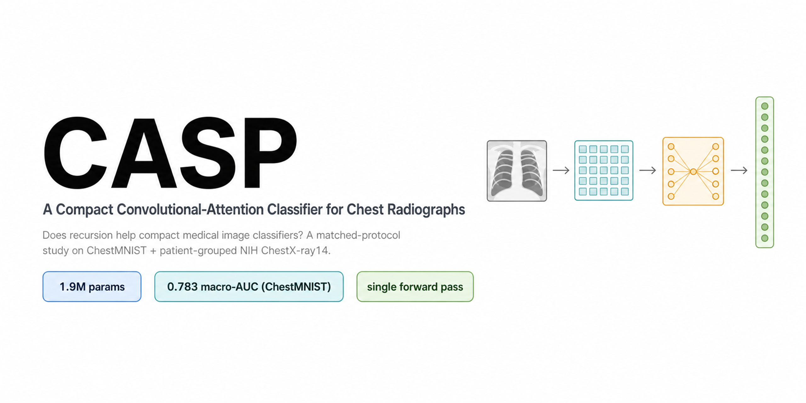

# CASP — A Compact Convolutional-Attention Classifier for Chest Radiographs

**Does recursion help compact chest-radiograph classifiers?**
A matched-protocol comparison of single-pass convolutional attention (**CASP**) against
recursive latent refinement, on ChestMNIST and patient-grouped NIH ChestX-ray14.

This repository contains everything needed to reproduce the paper: the two model
definitions, the matched-protocol training harness, the patient-grouped external
validation, the patient-clustered bootstrap, the calibration and FLOPs measurements,
and the figure scripts. Every reported number is produced by these scripts.

---

## Key result

All eight models are trained under **one identical protocol** (AdamW, 5% warmup then
cosine, 4000 steps, best-validation checkpoint, per-model learning-rate selection on
seed 0, five seeds, official test split evaluated once). CASP leads at a fraction of
the parameters, and a single convolutional-attention pass beats iterated recursive
refinement at matched parameters.

| Model | Params (M) | MACs (M) | ChestMNIST AUC | NIH-28 AUC |
|---|---:|---:|:---:|:---:|
| **CASP** (single pass) | **1.90** | 168 | **0.7826 ± 0.0019** | 0.7288 |
| CASP-matched (control) | 1.46 | 129 | 0.7777 ± 0.0024 | **0.7334** |
| DenseNet-121 | 6.96 | 680 | 0.7631 ± 0.0043 | 0.7158 |
| ResNet-18 | 11.17 | 457 | 0.7545 ± 0.0026 | 0.7039 |
| Recursive (TRM-style) | 1.49 | 293 | 0.7480 ± 0.0015 | 0.6914 |
| ResNet-50 | 23.53 | 1052 | 0.7454 ± 0.0021 | 0.6913 |
| Compact ViT | 1.80 | 89 | 0.7231 ± 0.0036 | 0.6731 |
| MobileNetV2 | 2.24 | 23 | 0.7167 ± 0.0041 | 0.6684 |

Patient-clustered bootstrap on patient-grouped NIH (B = 2000): single-pass attention
exceeds recursion at matched parameters by **+0.039 macro-AUC** (95% CI [+0.034, +0.044],
*p* < 5×10⁻⁴).

*ChestMNIST is a downsampled research benchmark; these are architectural comparisons,
not clinical performance claims.*

---

## Repository layout

```
best_nonrec.py        CASP: compact single-pass convolutional-attention classifier
best_rec.py           Recursive (TRM-style) latent-refinement baseline
bench_chestmnist.py   Matched-protocol head-to-head on ChestMNIST (all 8 models)
bench_nih.py          Patient-grouped external validation on NIH ChestX-ray14 (28x28)
nih_data.py           Builds the patient-disjoint NIH-28 splits from ChestX-ray14
nih_bootstrap.py      Patient-clustered bootstrap (point AUC, 95% CI, paired deltas)
ece.py                Expected calibration error (per-label mean and pooled)
flops.py              Parameters, forward MACs, and GPU latency for every model
plots.py              Regenerates all figures from the result files
trm_chest/            Data loaders and the macro-AUC metric
*_results.json        The exact result files behind every number in the paper
nih_probs/            Per-patient prediction probabilities (8 models x 5 seeds)
logs/                 Per-seed training logs + a full per-seed results summary
```

Both models expose the same interface:

```python
from best_nonrec import build_model      # CASP
net = build_model(num_classes=14, in_ch=1)
logits = net(x)                           # x: [B, 1, 28, 28] -> [B, 14]
```

---

## Setup

```bash
python -m venv .venv && source .venv/bin/activate   # (Windows: .venv\Scripts\activate)
pip install -r requirements.txt
```

ChestMNIST and PneumoniaMNIST are downloaded automatically by the `medmnist`
package on first use. NIH ChestX-ray14 (for the external validation) must be
obtained from its official source; `nih_data.py` then builds the patient-disjoint
28×28 splits.

---

## Reproduce

```bash
# 1. Matched-protocol ChestMNIST benchmark (all 8 models, 5 seeds)
python bench_chestmnist.py

# 2. Patient-grouped NIH external validation (saves per-patient probabilities)
python nih_data.py            # build NIH-28 patient-disjoint splits
python bench_nih.py

# 3. Statistics and cost
python nih_bootstrap.py       # patient-clustered bootstrap CIs + paired deltas
python ece.py                 # calibration (ECE)
python flops.py               # params / MACs / latency

# 4. Figures
python plots.py
```

Each script writes a `*.json` result file and is deterministic given the fixed
seeds. The committed `*_results.json` files let you regenerate the figures and the
tables without re-running training.

---

## Predictions and logs

For full transparency the repository ships the raw runs, not only summary numbers:

- **`nih_probs/`** — the per-patient test probabilities for all eight models across
  five seeds on patient-grouped NIH ChestX-ray14. `nih_bootstrap.py` and `ece.py`
  consume these directly, so the confidence intervals and calibration numbers can be
  regenerated without retraining. Running `python nih_bootstrap.py` on the shipped
  `nih_probs/` reproduces `nih_bootstrap.json` (and thus every bootstrap number in the
  paper) exactly.
- **`logs/`** — the per-seed training logs for the reported runs, plus
  `per_seed_results.txt`, the complete per-seed macro-AUC for every model on both
  benchmarks (also available inside the `*_results.json` files as `test_seeds`).

---

## License

Released under the MIT License (see `LICENSE`).

## Citation

A BibTeX entry will be added with the camera-ready version of the paper.
